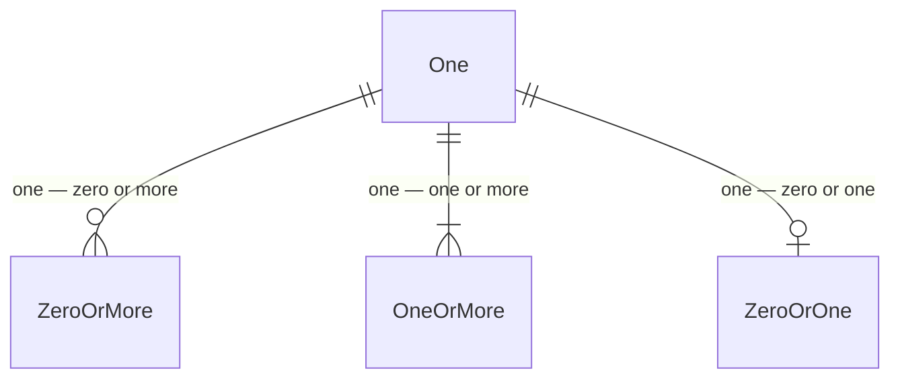

# Mermaid ERD relationship notation

```mermaid
erDiagram
    "One"      ||--o{  "ZeroOrMore" : "one — zero or more"
    "One"      ||--|{  "OneOrMore"  : "one — one or more"
    "One"      ||--o|  "ZeroOrOne"  : "one — zero or one"
```

You can think of each connector as "x or y", where:

- `⏺` is 0
- `|` is 1
- `∈` is many

(`||` would then be "1 or 1", which is just 1.)