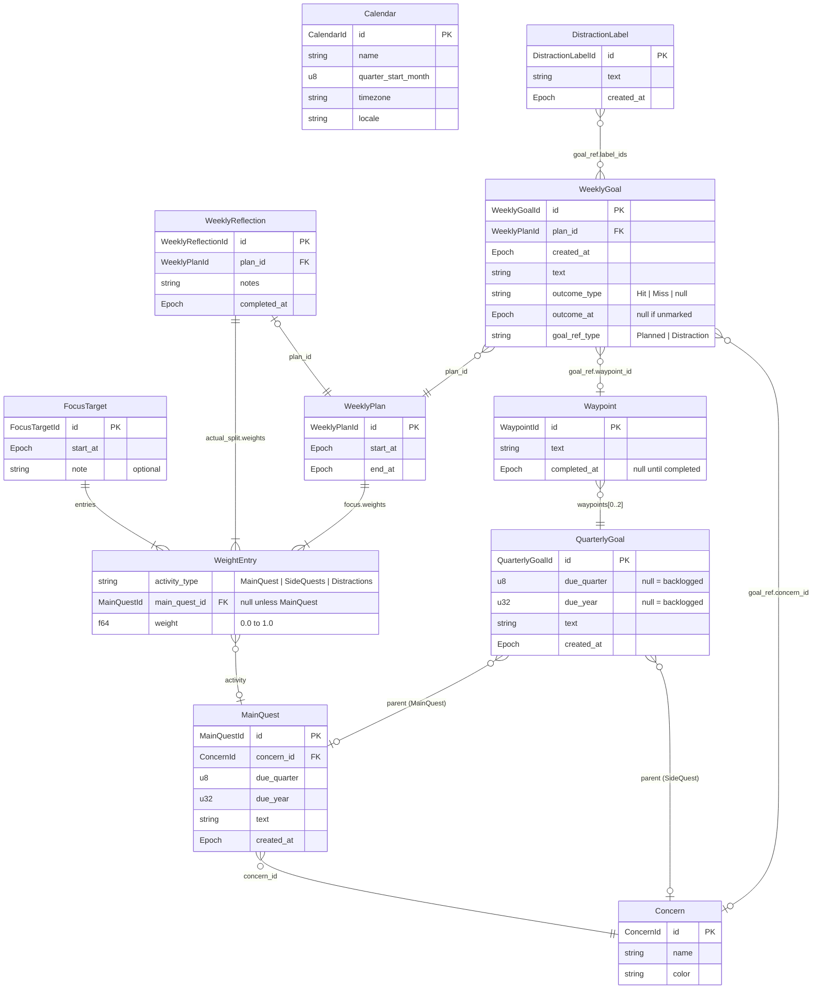

```mermaid
erDiagram
    Calendar {
        CalendarId id PK
        string name
        u8 quarter_start_month
        string timezone
        string locale
    }

    Concern {
        ConcernId id PK
        string name
        string color
    }

    MainQuest {
        MainQuestId id PK
        ConcernId concern_id FK
        u8 due_quarter
        u32 due_year
        string text
        Epoch created_at
    }

    QuarterlyGoal {
        QuarterlyGoalId id PK
        u8 due_quarter "null = backlogged"
        u32 due_year "null = backlogged"
        string text
        Epoch created_at
    }

    Waypoint {
        WaypointId id PK
        string text
        Epoch completed_at "null until completed"
    }

    FocusTarget {
        FocusTargetId id PK
        Epoch start_at
        string note "optional"
    }

    WeightEntry {
        string activity_type "MainQuest | SideQuests | Distractions"
        MainQuestId main_quest_id FK "null unless MainQuest"
        f64 weight "0.0 to 1.0"
    }

    WeeklyPlan {
        WeeklyPlanId id PK
        Epoch start_at
        Epoch end_at
    }

    WeeklyReflection {
        WeeklyReflectionId id PK
        WeeklyPlanId plan_id FK
        string notes
        Epoch completed_at
    }

    WeeklyGoal {
        WeeklyGoalId id PK
        WeeklyPlanId plan_id FK
        Epoch created_at
        string text
        string outcome_type "Hit | Miss | null"
        Epoch outcome_at "null if unmarked"
        string goal_ref_type "Planned | Distraction"
    }

    DistractionLabel {
        DistractionLabelId id PK
        string text
        Epoch created_at
    }

    FocusTarget ||--|{ WeightEntry : entries
    MainQuest }o--|| Concern : concern_id
    WeeklyReflection ||--|{ WeightEntry : "actual_split.weights"
    WeeklyReflection |o--|| WeeklyPlan : plan_id
    WeightEntry }o--o| MainQuest : activity
    QuarterlyGoal }o--o| MainQuest : "parent (MainQuest)"
    QuarterlyGoal }o--o| Concern : "parent (SideQuest)"
    Waypoint }o--|| QuarterlyGoal : "waypoints[0..2]"
    WeeklyPlan ||--|{ WeightEntry : "focus.weights"
    WeeklyGoal }o--|| WeeklyPlan : plan_id
    WeeklyGoal }o--o| Waypoint : "goal_ref.waypoint_id"
    WeeklyGoal }o--o| Concern : "goal_ref.concern_id"
    DistractionLabel }o--o{ WeeklyGoal : "goal_ref.label_ids"
```
